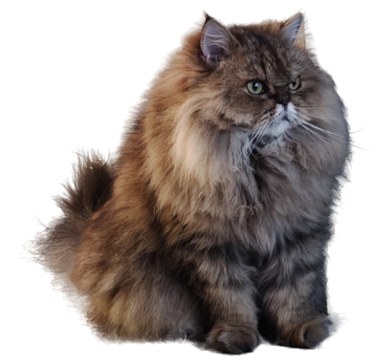

# DesktopPet 桌面宠物

一只常驻桌面的小猫，基于 PySide6 实现。窗口透明、置顶、可拖拽，带呼吸与头部跟随动画。



## 功能

- 透明无边框窗口，可拖到任意位置（支持多显示器）
- 始终置顶（默认开启，可在右键菜单切换）
- 自动走动（默认关闭，可在右键菜单开启）：宠物在当前屏幕右下 1/4 区域内随机游走，到达目标后停留数秒再走向下一处；拖拽或菜单打开时暂停
- 呼吸起伏与头部跟随鼠标的动画；系统开启“减少动态效果”时自动停止动画（含自动走动与输入跟随）
- 双击互动、右键菜单、滚轮缩放（仅纵向滚动生效）
- 输入跟随（默认开启，可在右键菜单关闭）：在前台文本控件输入时跟随插入光标，临时缩小；自动避开输入框和可读取的 IME 候选区域，停止输入 1 秒后恢复原位置和缩放
- 跟随时的大小可在右键菜单「输入跟随大小」中选择（20% / 25% / 30% / 40%，为绝对比例，与平时大小无关）
- 气泡对话框，按宠物当前所在屏幕定位，停留时长随文字长度
- 闲置提醒：一段时间没有互动（约 1.5~3 分钟随机）时，宠物自动弹出一条随机语录
- 右键菜单里的开关与缩放比例会自动保存，下次启动沿用

## 运行

```powershell
pip install PySide6
python pet_v2.py
```

实现在 `desktoppet/` 包里，`pet_v2.py` 只是启动入口。（第一版单文件 `pet.py` 已从仓库移除，可在 v1.3.3 之前的历史中找到。）

## 代码结构

| 模块 | 职责 |
| --- | --- |
| `desktoppet/config.py` | 应用级常量、素材路径 |
| `desktoppet/settings.py` | QSettings 偏好持久化 |
| `desktoppet/debuglog.py` | 可选调试日志（见下） |
| `desktoppet/winapi.py` | Win32 ctypes 声明、窗口与进程查询 |
| `desktoppet/uia.py` | UI Automation（COM）封装 |
| `desktoppet/ime.py` | IME 候选框探测与节流缓存 |
| `desktoppet/placement.py` | 输入跟随的落位几何（纯函数） |
| `desktoppet/input_follow.py` | 前台插入符 / 焦点 / 候选区采集 |
| `desktoppet/keyboard.py` | 全局键盘钩子 |
| `desktoppet/sprite.py` | 素材分层 |
| `desktoppet/autostart.py` | 开机自启动（注册表） |
| `desktoppet/animation_mixin.py` | 呼吸 / 头部跟随 / 互动动画 |
| `desktoppet/walk_mixin.py` | 自动走动状态机 |
| `desktoppet/input_follow_mixin.py` | 输入光标跟随的窗口侧逻辑 |
| `desktoppet/keyboard_mixin.py` | 键盘互动（脚掌拍键）绘制与响应 |
| `desktoppet/menu_mixin.py` | 右键菜单与各开关 |
| `desktoppet/bubble.py`、`pet.py`、`app.py` | 气泡、主窗口（组装各 Mixin）、入口 |

## 测试

```powershell
pip install pytest
python -m pytest
```

## 排查问题

程序对 Win32 / COM 的探测失败时会静默降级。需要定位时打开调试日志：

```powershell
$env:DESKTOPPET_DEBUG = "1"      # 输出到 stderr
$env:DESKTOPPET_LOG = "C:\pet.log"   # 或追加到文件
python pet_v2.py
```

## 打包成 exe

```powershell
pip install pyinstaller
python -m PyInstaller DesktopPetV2.spec
```

产物在 `dist/DesktopPetV2.exe`，单文件、无控制台窗口。
版本号只在 `desktoppet/__init__.py` 的 `APP_VERSION` 里维护，`version_info.txt` 由 spec 在打包时自动生成。

